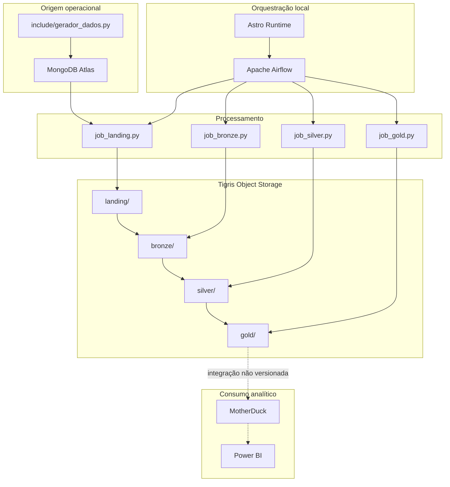

# Arquitetura

## Visão de componentes



## Responsabilidades

### MongoDB Atlas

É a fonte do pipeline. O banco usado por padrão é `gearlog_erp`. A conexão efetiva dos jobs é feita por `MONGO_URI`, e não pela conexão `mongo_default` cadastrada no Airflow.

### Astro e Airflow

O Astro Runtime fornece o ambiente local do Airflow. Cada DAG usa um `BashOperator` para executar diretamente um script Python em `/usr/local/airflow/notebooks`.

As DAGs possuem o mesmo agendamento, mas atualmente não têm dependências entre si. Portanto, o desenho em sequência representa a dependência lógica dos dados, não uma garantia do orquestrador.

### Spark e Delta Lake

Cada job cria sua própria `SparkSession`, adicionando em tempo de execução:

- `delta-core_2.12:2.4.0`;
- `hadoop-aws:3.3.4`;
- extensão e catálogo Delta;
- configurações S3A para o Tigris.

### Tigris

O bucket padrão é `projeto-lakehouse-satc`. A estrutura lógica esperada é:

```text
s3a://projeto-lakehouse-satc/
├── landing/<entidade>/
├── bronze/<entidade>/
├── silver/<entidade>/
└── gold/
    ├── dim_cliente/
    ├── dim_mecanico/
    ├── dim_veiculo/
    ├── dim_fornecedor/
    ├── dim_peca/
    └── fato_ordens_servico/
```

### MotherDuck e Power BI

O README define o MotherDuck como warehouse para consumo pelo Power BI. O repositório contém as dependências do DuckDB, mas não contém um job legível que publique a Gold no MotherDuck. Essa fronteira deve ser tratada como integração externa ou etapa futura.

## Decisões arquiteturais atuais

| Decisão | Consequência |
| --- | --- |
| Extrações completas | Implementação simples, porém com maior custo e risco de duplicação |
| Bronze em `append` | Mantém cargas anteriores, mas não possui identificador único de lote |
| Silver em `overwrite` | Produz uma visão consolidada a cada execução |
| Dimensões com SCD Tipo 2 | Preserva alterações de atributos das entidades dimensionais |
| Fato em Parquet | Facilita leitura, mas fica diferente do formato usado nas dimensões |
| DAG por camada | Permite execução isolada, mas exige coordenação externa da ordem |
