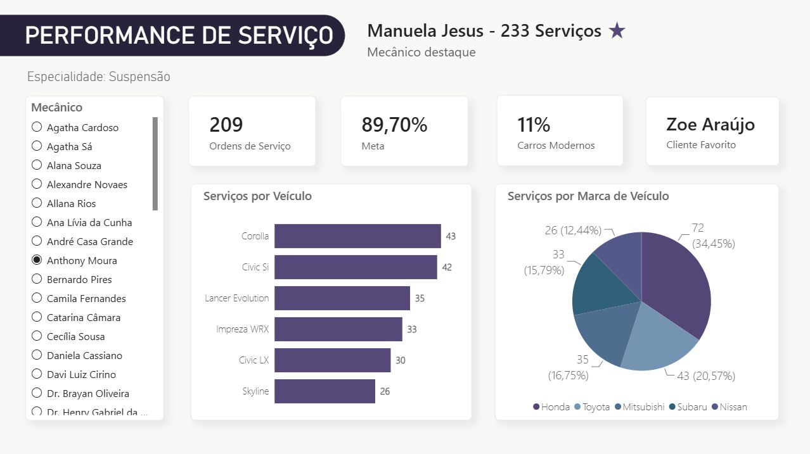

# Dashboard analítico

Esta página registra o print real do relatório de **Performance de Serviço** desenvolvido no Power BI para o projeto. A captura mostra a visão operacional usada para acompanhar ordens de serviço, mecânicos, veículos e marcas atendidas.

!!! info "Origem do print"

    Este print foi extraído do arquivo `.pbix` gerado pelo projeto e deve ser atualizado sempre que o painel real sofrer alterações visuais ou estruturais.

## Performance de Serviço

O painel apresenta:

- segmentação de dados (filtro lateral) por mecânico;
- especialidade analisada, neste caso `Estética Automotiva`;
- mecânico destaque, com total de serviços realizados;
- quantidade de ordens de serviço;
- percentual de carros modernos;
- cliente favorito;
- ranking de serviços por veículo;
- distribuição de serviços por marca de veículo.

## Indicadores visíveis no print

| Indicador | Valor exibido |
| --- | --- |
| Especialidade | Estética Automotiva |
| Mecânico destaque | Manuela Jesus |
| Serviços do mecânico destaque | 233 |
| Ordens de serviço | 211 |
| Carros modernos | 9% |
| Cliente favorito | Ísis das Neves |
| Veículo com mais serviços | Civic LX |
| Marca com mais serviços | Honda |

## Manutenção dos prints

Quando o relatório do Power BI for alterado, atualize o arquivo `docs/assets/images/dashboard-performance-servico.png` e mantenha esta página sincronizada com:

1. a fonte de dados usada pelo painel;
2. os filtros aplicados no momento da captura;
3. os indicadores exibidos;
4. a data ou versão do dashboard capturado.