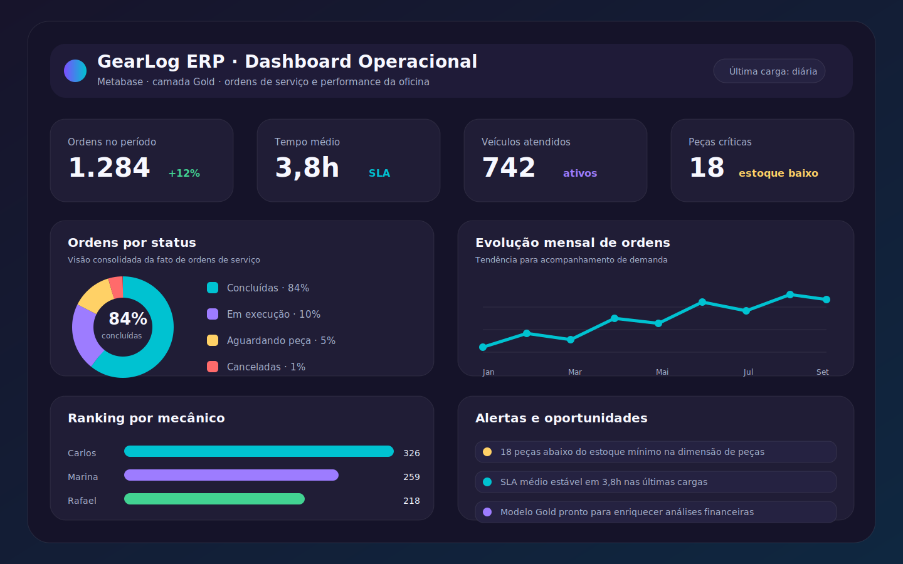
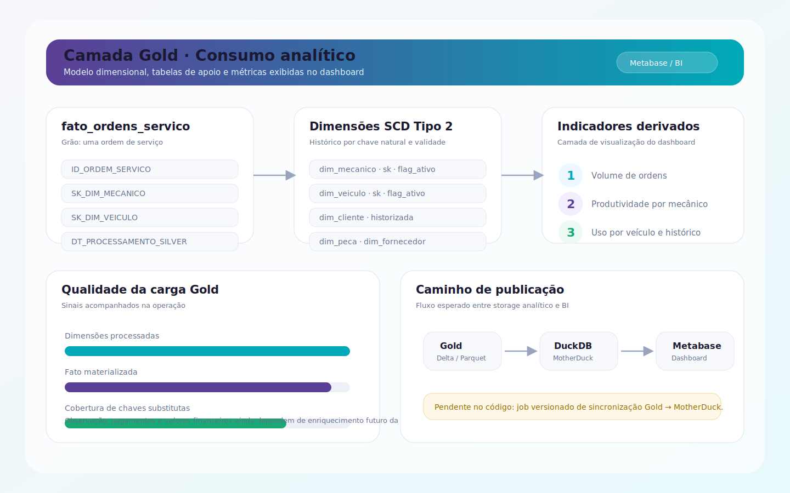

# Dashboard analítico

Esta página registra os prints do dashboard analítico associado ao consumo da camada Gold. O painel foi documentado a partir do desenho de consumo previsto para Metabase/MotherDuck e dos dados disponíveis no modelo dimensional do projeto.

!!! note "Escopo do dashboard"

    O pipeline já materializa dimensões e uma fato simplificada em Gold, mas a rotina versionada de publicação da Gold no MotherDuck ainda não existe no repositório. Por isso, os prints abaixo funcionam como referência visual do dashboard esperado e devem ser atualizados quando o painel real do Metabase for versionado ou exportado.

## Visão geral operacional

O primeiro print resume indicadores operacionais de ordens de serviço:

- volume de ordens;
- tempo médio de atendimento;
- distribuição por status;
- evolução mensal;
- ranking por mecânico;
- alertas de peças e manutenção.

## Consumo da camada Gold

O segundo print mostra como o painel se conecta conceitualmente às tabelas analíticas:

- `fato_ordens_servico`;
- `dim_mecanico`;
- `dim_veiculo`;
- dimensões SCD Tipo 2;
- métricas derivadas para operação e gestão.

## Manutenção dos prints

Quando o dashboard real for alterado no Metabase, atualize os arquivos em `docs/assets/images/` e mantenha esta página sincronizada com:

1. a fonte de dados usada pelo Metabase;
2. as tabelas Gold expostas ao consumo;
3. o significado de cada indicador;
4. a data ou versão do painel capturado.
