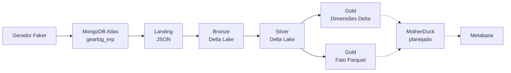

# Projeto ED SATC

O **Projeto ED SATC** é um Data Lakehouse acadêmico que processa dados de um ERP fictício de oficina mecânica, o **GearLog ERP**. A solução percorre as camadas Landing, Bronze, Silver e Gold e usa serviços de nuvem para armazenar e disponibilizar os dados.

-   :material-database-arrow-right:{ .lg .middle } **Conheça o pipeline**

    ---

    Entenda como os dados saem do MongoDB e atravessam cada camada do Lakehouse.

    [:octicons-arrow-right-24: Processamento por camada](pipeline.md)

-   :material-graph-outline:{ .lg .middle } **Explore a arquitetura**

    ---

    Veja os componentes, responsabilidades e fronteiras entre o implementado e o planejado.

    [:octicons-arrow-right-24: Arquitetura](arquitetura.md)

-   :material-table-key:{ .lg .middle } **Consulte o modelo de dados**

    ---

    Conheça as coleções de origem, relacionamentos e o modelo dimensional da Gold.

    [:octicons-arrow-right-24: Modelo de dados](modelo-dados.md)

-   :material-play-circle-outline:{ .lg .middle } **Execute o ambiente**

    ---

    Configure variáveis, inicie o Airflow e suba o Metabase localmente.

    [:octicons-arrow-right-24: Execução local](execucao.md)

## Fluxo principal

!!! info "Estado da implementação"

    Landing, Bronze, Silver, Gold, Airflow e o container local do Metabase possuem implementação no repositório. A transferência da Gold para o MotherDuck é descrita na arquitetura do projeto, mas ainda não possui rotina versionada no código.

## Tecnologias centrais

| Área | Tecnologia | Responsabilidade |
| --- | --- | --- |
| Fonte | MongoDB Atlas | Armazena os dados operacionais do ERP fictício |
| Orquestração | Astro CLI e Apache Airflow | Agenda e executa os jobs das camadas |
| Processamento | PySpark 3.4.1 | Lê, transforma e grava os conjuntos de dados |
| Formato | Delta Lake 2.4.0 e Parquet | Mantém tabelas do Lakehouse |
| Object storage | Tigris | Armazena Landing, Bronze, Silver e Gold via S3A |
| BI | Metabase | Permite consultas, análises e dashboards |

## Comece por aqui

1. Leia a [visão geral](projeto.md).
2. Consulte os [pré-requisitos e variáveis](configuracao.md).
3. Siga a [execução local](execucao.md).
4. Antes de operar o pipeline, conheça as [limitações atuais](qualidade-limitacoes.md).
