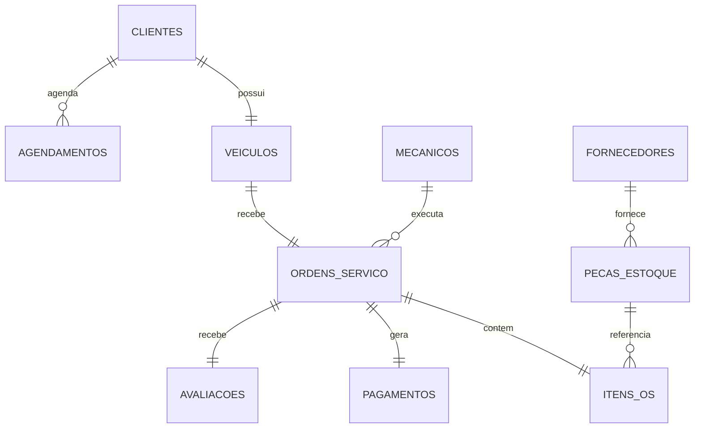

# Modelo de dados

## Modelo operacional

O gerador cria dez coleções no MongoDB. Os identificadores são numéricos e armazenados originalmente no campo `_id`; na Silver, esse nome é normalizado para `ID`.

!!! note "Cardinalidades da massa atual"

    Embora alguns relacionamentos admitam vários registros no domínio real, o gerador atual cria exatamente um veículo, uma ordem, um item, um pagamento e uma avaliação para cada índice de 1 a 10.000.

## Dicionário das coleções

| Coleção | Volume gerado | Campos principais | Relacionamentos |
| --- | ---: | --- | --- |
| `mecanicos` | 50 | `_id`, `nome`, `especialidade` | Referenciada por `ordens_servico.id_mecanico` |
| `fornecedores` | 100 | `_id`, `nome`, `cnpj` | Referenciada por `pecas_estoque.id_fornecedor` |
| `clientes` | 10.000 | `_id`, `nome`, `cpf`, `telefone` | Referenciada por veículos e agendamentos |
| `veiculos` | 10.000 | `_id`, `id_cliente`, `marca`, `modelo`, `ano`, `placa` | Referenciada por ordens de serviço |
| `pecas_estoque` | 10.000 | `_id`, `id_fornecedor`, `nome`, `preco`, `quantidade_estoque` | Referenciada por itens de OS |
| `ordens_servico` | 10.000 | `_id`, `id_veiculo`, `id_mecanico`, `data_entrada`, `status` | Entidade transacional central |
| `itens_os` | 10.000 | `_id`, `id_os`, `id_peca`, `quantidade` | Liga ordens e peças |
| `pagamentos` | 10.000 | `_id`, `id_os`, `valor_total`, `metodo` | Valores recebidos por ordem |
| `agendamentos` | 10.000 | `_id`, `id_cliente`, `data_agendada`, `servico_solicitado` | Agenda de clientes |
| `avaliacoes` | 10.000 | `_id`, `id_os`, `nota`, `comentario` | Avaliação de uma ordem |

## Modelo Gold

### Dimensões

O job Gold cria dimensões para clientes, mecânicos, veículos, fornecedores e peças. Cada dimensão possui:

| Campo técnico | Uso |
| --- | --- |
| `ID` | Chave natural proveniente da Silver |
| `sk` | Chave substituta calculada por MD5 |
| `data_inicio` | Início da validade da versão |
| `data_fim` | Fim da validade; nulo na versão ativa |
| `flag_ativo` | Indica a versão atual |
| `hash_atributos` | Identifica mudanças nos atributos de negócio |

Quando o hash de uma entidade muda, a versão ativa é encerrada e uma nova versão é adicionada.

### Fato de ordens de serviço

`fato_ordens_servico` é gerada a partir de `silver/ordens_servico` e tenta enriquecer os registros com itens e dimensões ativas.

No estado atual, ela mantém principalmente:

- `ID` da ordem;
- `DATA_HORA_SILVER_TS`;
- `SK_DIM_MECANICO`;
- `SK_DIM_VEICULO`.

O job procura uma coluna de valor nos itens, mas `itens_os` contém quantidade e referências, sem preço ou valor total. Por isso, o agregado `VALOR_TOTAL` não é produzido com a massa atual. A coleção `pagamentos`, que possui `valor_total`, ainda não é usada pela Gold.

!!! warning "Modelo dimensional parcial"

    Cliente, fornecedor e peça são materializados como dimensões, mas são intencionalmente ignorados no relacionamento direto com a fato. Datas, status, pagamentos, avaliações e agendamentos também não aparecem no resultado final atual.
