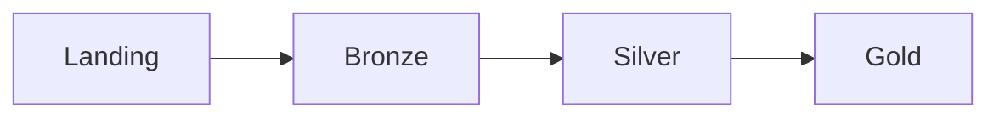

# Orquestração com Airflow

## DAGs disponíveis

| DAG ID | Script executado | Agendamento | Tentativas |
| --- | --- | --- | ---: |
| `ingestao_camada_landing` | `job_landing.py` | Diário | 2 |
| `ingestao_camada_bronze` | `job_bronze.py` | Diário | 1 |
| `processamento_camada_silver` | `job_silver.py` | Diário | 2 |
| `processamento_camada_gold` | `job_gold.py` | Diário | 2 |

Todas têm data inicial em 18 de junho de 2026, `catchup=False` e intervalo de cinco minutos entre tentativas.

## Dependência lógica e dependência operacional



Essa é a dependência lógica dos dados. No Airflow, porém, cada bloco acima pertence a uma DAG separada. Não existem `Dataset`, `TriggerDagRunOperator`, sensores ou uma DAG controladora conectando as etapas.

!!! warning "Ordem não garantida"

    Ativar as quatro DAGs com o mesmo `@daily` não garante que a camada anterior termine antes da próxima começar. Na operação manual, execute-as na ordem Landing, Bronze, Silver e Gold.

## Execução dos jobs

Cada DAG possui um único `BashOperator`. O comando segue este formato:

```bash
python /usr/local/airflow/notebooks/job_landing.py
```

Isso pressupõe que a pasta `notebooks` do projeto esteja disponível nesse caminho dentro do container Astro.

## Conexões e variáveis locais

`airflow_settings.yaml` cadastra:

- conexão `tigris_default`;
- conexão `mongo_default`;
- variável `tigris_bucket`;
- variável `tigris_endpoint`;
- pool `default_pool` com 128 slots.

Os jobs atuais não usam `BaseHook`, `MongoHook`, `S3Hook` nem `Variable.get()`. Eles carregam configurações diretamente do ambiente com `python-dotenv`.

## Teste de integridade das DAGs

`tests/dags/test_dag_example.py` verifica:

- erros de importação;
- presença de tags;
- pelo menos duas tentativas por DAG.

A DAG Bronze configura uma tentativa e, portanto, não atende atualmente ao último teste.
